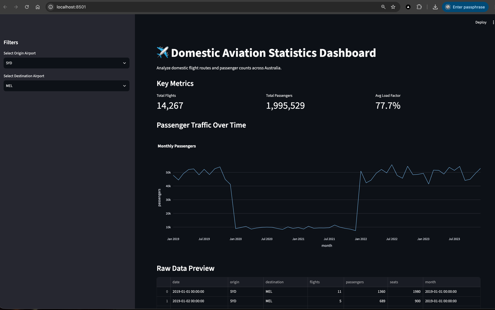

# Project 26: Real-time Dashboard

This project demonstrates how to build a highly performant, interactive dashboard for data analysis. It leverages Streamlit for the user interface, Plotly for interactive charting, and DuckDB for ultra-fast SQL querying directly over large Parquet files.

## Screenshot(s) 

## Learning Objectives
1. Build an interactive web dashboard using Streamlit.
2. Understand the advantages of columnar storage formats like Parquet.
3. Learn how to use DuckDB to perform lightning-fast SQL queries on large datasets without loading them entirely into memory.
4. Visualize data trends using Plotly.

## Data Source
- **Real Data**: The "Domestic Aviation Statistics" dataset from [data.gov.au](https://data.gov.au/).
- **Fallback**: A local synthetic Parquet dataset (`data/mock_flights.parquet`) is provided containing several years of simulated domestic flight data between major Australian cities.

## See Also
- [QUICKSTART.md](QUICKSTART.md): Instructions on how to run and test the project.
- [docs/theory.md](docs/theory.md): Brief theoretical concepts on columnar storage and in-memory analytics.
- `images/`: Contains screenshots of the working dashboard.
