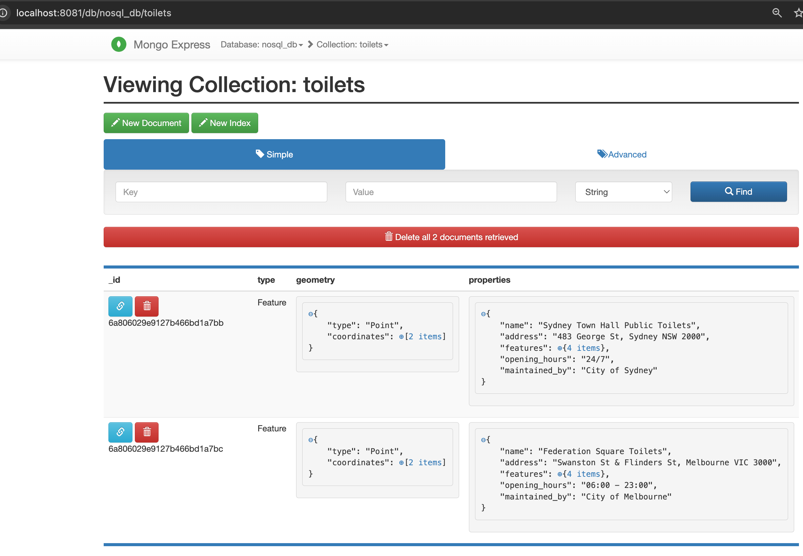

# Project 27: NoSQL Data Store

This project demonstrates how to build a FastAPI backend backed by a MongoDB database. It is designed to handle unstructured, nested, and schema-less data, which is common in modern web development.

## Screenshot(s)

 

## Learning Objectives
1. Understand the difference between Relational (SQL) and NoSQL databases.
2. Build a FastAPI REST API that interacts directly with a NoSQL database using `pymongo`.
3. Learn how to query complex, deeply nested JSON structures (e.g., GeoJSON).
4. Gain experience using Mongo Express as a Web UI to manage MongoDB collections.

## Data Source
- **Real Data**: The "National Public Toilet Map" from [data.gov.au](https://data.gov.au/) often comes in GeoJSON format.
- **Fallback**: A local synthetic JSON dataset (`data/mock_toilets.json`) is provided and automatically loaded into the database on startup.

## See Also
- [QUICKSTART.md](QUICKSTART.md): Instructions on how to run and test the project.
- [docs/theory.md](docs/theory.md): Brief theoretical concepts on NoSQL and MongoDB.
- `images/`: Contains screenshots of the working API and database.
