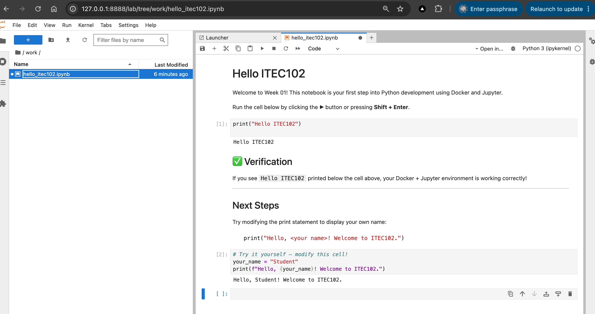

# ITEC102 - Week 01 — Running Jupyter Notebook with Docker

[Docker](https://www.docker.com/) lets you run applications in isolated containers, ensuring a consistent environment across all machines. This guide shows you how to run a Jupyter Notebook server using Docker — no Python installation required on your host machine!

# Screenshot(s)



---

## Topics

### 1. Setup Docker (Revisit Week 00)

If you haven't set up Docker yet, revisit the Week 00 guide:

- 🔗 [Week 00 — Docker Setup](https://github.com/vuhung16au/ACU-ITEC102/blob/main/Week00/05.docker.md)

**Quick start checklist:**
- [ ] Docker Desktop is installed and running
- [ ] You can run `docker --version` in your terminal
- [ ] You can run `docker compose version` in your terminal

---

### 2. Run Jupyter Notebook in a Docker Container

We use the official [`jupyter/scipy-notebook`](https://hub.docker.com/r/jupyter/scipy-notebook) Docker image, which comes pre-installed with Python, Jupyter, and many scientific libraries.

**Folder structure for this exercise:**

```
03.docker+Jupyter/
├── docker-compose.yml
└── notebooks/
    └── hello_itec102.ipynb
```

---

## Files

### `docker-compose.yml`

This file defines the Docker service configuration. It is already included in this folder.

```yaml
# See docker-compose.yml in this folder
```

### `notebooks/hello_itec102.ipynb`

A sample Jupyter Notebook with a "Hello World" exercise. It is already included in the `notebooks/` folder.

---

## ✅ Getting Started

### Step 1 — Start the container

Open a terminal, navigate to this folder, and run:

```bash
docker compose up
# not `docker compose up -d` because we want to see the logs in the terminal
```

You will see output similar to:

```
jupyter-notebook  |     To access the server, open this file in a browser:
jupyter-notebook  |         ...
jupyter-notebook  |     Or copy and paste one of these URLs:
jupyter-notebook  |         http://127.0.0.1:8888/lab?token=<your-token>
```

### Step 2 — Open Jupyter in your browser

Copy the URL from the terminal output (including the token) and paste it into your browser:

```
http://127.0.0.1:8888/lab?token=<your-token>
```

### Step 3 — Open the sample notebook

In the Jupyter file browser (left panel), navigate to `hello_itec102.ipynb` and open it.

### Step 4 — Run the notebook

Run the code cell by clicking ▶ or pressing `Shift + Enter`.

**Expected output:**
```
Hello ITEC102
```

### Step 5 — Stop the container

When you are done, stop the container by pressing `Ctrl + C` in the terminal, then run:

```bash
docker compose down
```

---

## 💡 Tips

- **Your notebooks are persisted** — the `notebooks/` folder on your host machine is mounted into the container, so changes are saved even after the container stops.
- **No data loss** — stopping and restarting the container will not delete your notebooks.
- **Token authentication** — the token in the URL is a security feature. Copy the full URL from the terminal output each time you start the container (or set a fixed password in the compose file).

---

## 📚 Additional Resources

- [Jupyter Docker Stacks Documentation](https://jupyter-docker-stacks.readthedocs.io/)
- [Docker Compose Reference](https://docs.docker.com/compose/)
- [Docker Desktop](https://www.docker.com/products/docker-desktop/)
